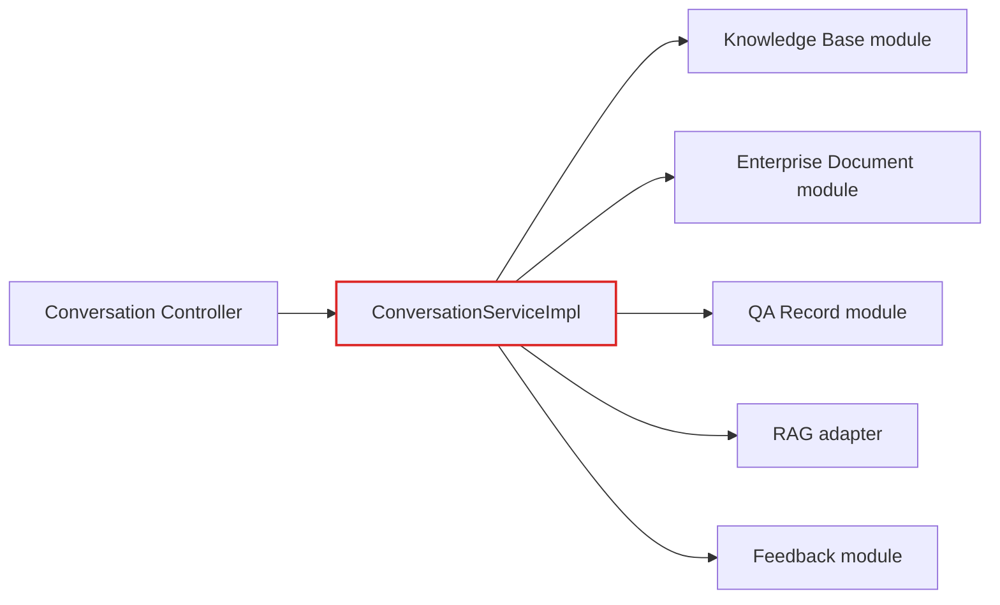
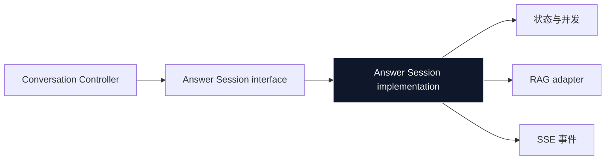
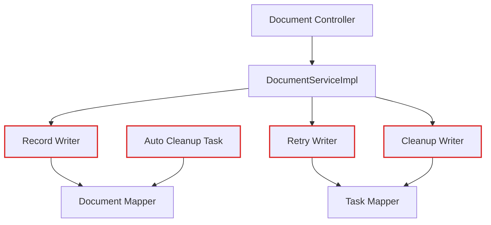
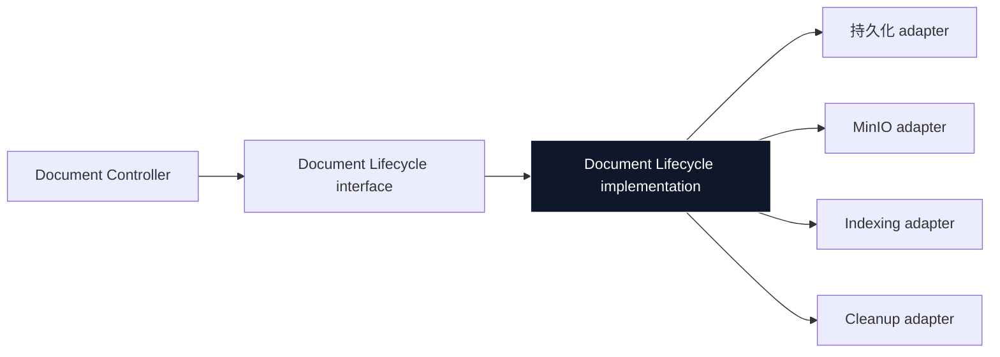
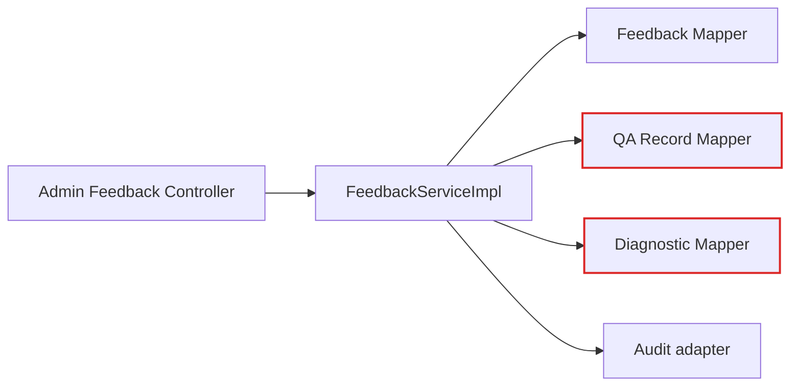
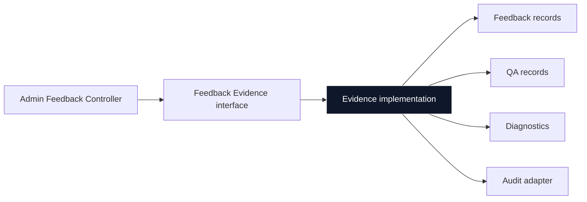

# ruoyi-kb-management 架构评审

> 架构评审 · 2026-08-06
>
> 实线框：module　虚线：seam　红线：跨 seam 泄漏　深色框：deep module

## 1. 深化会话回答编排 module

**状态：`resolved`**

依赖类别：进程内 · ports & adapters

涉及文件：`conversation/service/impl/ConversationServiceImpl.java` · `qarecord/service/QaRecordService.java` · `conversation/service/port/RagAnswerPort.java`

### 现状：职责聚集但 interface 过宽

### 目标：小 interface，深 implementation

### 问题

372 行的 implementation 同时处理会话 CRUD、历史投影、回答事务、SSE、停止信号、RAG 取消、终态裁决和反馈标记；调用者必须理解过多行为。

### 方案

将回答生命周期收敛为一个 Answer Session module，对外只暴露开始、事件流、状态查询和显式停止的 interface；持久化与 RAG adapter 留在内部 seam 后。

### 收益

- locality：取消与终态决策集中
- leverage：SSE 与快照复用同一 interface
- 测试穿过 interface，不必装配 7 个 collaborator

---

## 2. 收拢企业文档生命周期 module

**状态：`resolved`**

依赖类别：ports & adapters · 可本地替换

涉及文件：`document/service/impl/DocumentServiceImpl.java` · `DocumentRecordWriterImpl.java` · `RetryRecordWriter.java` · `CleanupRecordWriter.java` · `AutoCleanupTask.java`

### 现状：状态知识分散

### 目标：统一 lifecycle implementation

### 问题

上传、重试、清理、回调和 scheduler 各自了解一部分企业文档状态机。`DocumentServiceImpl` 有 9 个依赖并直接依赖具体 MinIO adapter。

### 方案

用一个 Document Lifecycle module 拥有状态迁移、幂等、尝试次数和投递时机；MinIO、索引与清理通过 adapter 进入。

### 收益

- locality：迁移规则只有一个位置
- leverage：scheduler 和回调复用裁决
- 测试可替换 adapter，而不是 mock 具体类

---

## 3. 在读取 seam 后封装反馈证据

**状态：`pending`**

依赖类别：进程内 · mock

涉及文件：`feedback/service/impl/FeedbackServiceImpl.java` · `qarecord/mapper/QaRecordMapper.java` · `qarecord/mapper/RetrievalDiagnosticMapper.java`

### 现状：Feedback 跨 seam 读取持久化

### 目标：稳定的证据读取 interface

### 问题

Feedback implementation 直接注入问答和检索诊断 Mapper，泄漏持久化细节，违反跨能力只调用公开 application interface 的约束。

### 方案

建立 Feedback Evidence read module，返回已授权的问答快照与诊断；隐私、同意和脱敏规则与证据组装放进该 implementation。

### 收益

- locality：授权与隐私规则集中
- leverage：管理视图共用可测试的读取 contract
- 移除 Feedback 对跨能力 Mapper 的依赖

---

## 首选建议

### 深化会话回答编排 module

它拥有最高 leverage：实现规模最大，且 SSE、取消和问答终态都是变化频繁的公开行为。目前这些责任被一个需要六个以上 collaborator 的浅 interface 暴露出来。
